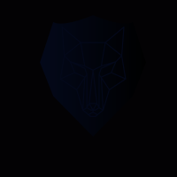

### Hi there, I'm Rohan -Vishwakarma  👋 

<!--  -->

<h1 align="center">
   
  
   
  R0han45@DEV
   
</h1>

## I'm a Fullstack Developer with ML/AI enthusiastic, Freelancer, Motivated Quoter, Developer, and a Sportsperson!!

- 🔭 I just started Exploring Myself Just Kidding 🤣🤣🤣!
- 🌱 I’m currently learning everything and implementing🤣
- 👯 I’m looking to collaborate with other content creators
- 🥅 2021 Goals: Want to Contribute to Open Source projects and want to learn more and explore my limits
- ⚡ Fun fact: I love to draw and play guitar / drums

### Connect with me:

[][twitter]
[][linkedin]
[][instagram]

 

### Languages and Tools:

<code></code>
<code></code>
<code></code>
<code></code>    

 
 

[twitter]: https://twitter.com/Rohan89483334
[instagram]: https://instagram.com/_r0han_45
[linkedin]: https://linkedin.com/in/rohan-vishwakarma-99565b176
